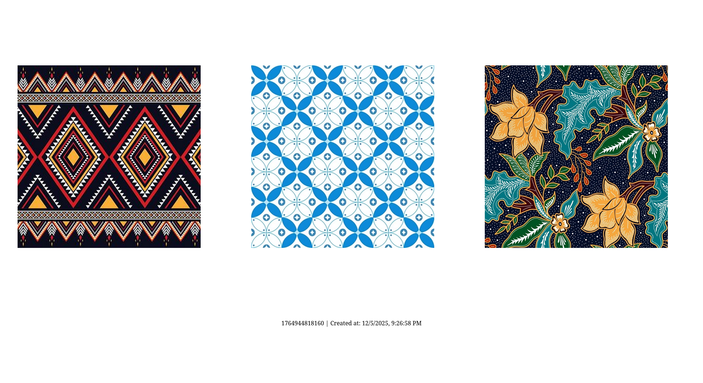

To install dependencies:

```sh
bun install
```

To run:

```sh
bun run dev
```

# Usage

## Generate 3 Pattern Image

Open http://localhost:3000/pattern



## Scan 3 Pattern using our Unity AR apps

Download here: ...

---

# Developer Usage

## Presence

POST /pattern/scan

```json
{
  "codes": 123,
  "npm": "5220411040",
  "name": "Agil Ghani Istikmal"
}
```

## Leaderboard

GET /pattern/leaderboard?codes=123
